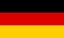

```{r setup, include=FALSE}
knitr::opts_chunk$set(echo = TRUE)
library(readxl)
library(kableExtra)
library(dplyr)
library(glue)
```

```{r, echo = F, warning=FALSE, message=F}
# Sommer 2026
mhb_baseurl <- 'https://statistik.tu-dortmund.de/storages/statistik/r/Downloads/Studium/Studiengaenge-Infos/ModHb_MSc_ECMTX_261125_Arbeit.pdf#page='

Kurse <- read_xlsx("KurseMscECMX_SoSe26.xlsx", sheet = "Kursliste") %>%
  distinct(Kurs, Ort, .keep_all = T) %>% 
  mutate(Course = glue("<a href='{Link_aktuelle_Veranstaltungsuebersicht}' target='_blank'>{Kurs}</a>")) %>%
  mutate('aktuell_angeboten_link' = glue("<a href='{Link_aktuelle_Veranstaltungsuebersicht}' target='_blank'> {aktuell_angeboten} </a>")) %>% 
  rename(
    Location = Ort, 
    Language = Sprache,
    Group = Modulgruppe,
    Credits = CP,
    'Summer 26' = aktuell_angeboten_link
  )

# Set a 'coming soon' text for courses without URL and add link to 404 page. Add comment if module name is different than course name
Kurse <- Kurse %>% 
  mutate(Course = dplyr::case_when(
    # Routines if MHB is not there.
    is.na(MHB) & aktuell_angeboten == 'no' ~ glue("<a href='../../404.html' target='_blank'>{Kurs} </a> <br>New course. More info coming soon!"),
    is.na(MHB) & aktuell_angeboten == 'yes' ~ glue("<a href='{Link_aktuelle_Veranstaltungsuebersicht}' target='_blank'>{Kurs}</a>"), 
    MHB == "NA"  & aktuell_angeboten == 'no' ~ glue("<a href='../../404.html' target='_blank'>{Kurs}</a> <br>New course. More info coming soon!"),
    MHB == "NA" & aktuell_angeboten == 'yes' ~ glue("<a href='{Link_aktuelle_Veranstaltungsuebersicht}' target='_blank'>{Kurs}</a>"),
    # 
    Kurs != Modulname & !is.na(MHB) ~ glue("<a href='{mhb_baseurl}{MHB}' target='_blank'>{Kurs}</a> <br>Course in the module"),
    # default values
    .default = Course
  )) %>%
  dplyr::mutate(Language = dplyr::case_when(
    Language == 'deutsch' ~ "",
    Language %in% c("englisch", "english", "english (except german gets unanimous vote)") ~ "",
    Language %in%  c("deutsch/englisch", "english/german", "deutsch/english") ~ "",
    .default = NA_character_)
  )

# select columns of interest
Kurse <- Kurse %>% select(Course, Group, Credits, `Offered by`, Location, Language, `Summer 26`) %>%
  dplyr::arrange(desc(`Summer 26`)) %>%
  rename("Offered in Summer 26?" = "Summer 26")
  

kable(Kurse, 
      escape = F,  
      format = "html",
      table.attr = 'id=\"table_id\"', 
      align = "c") %>%
  kable_styling(full_width = T,
                bootstrap_options = c("striped", "hover", "responsive")) %>%
  column_spec(1, bold = T, border_right = F, width = "15em") %>%
  column_spec(2, border_right = F)
```
